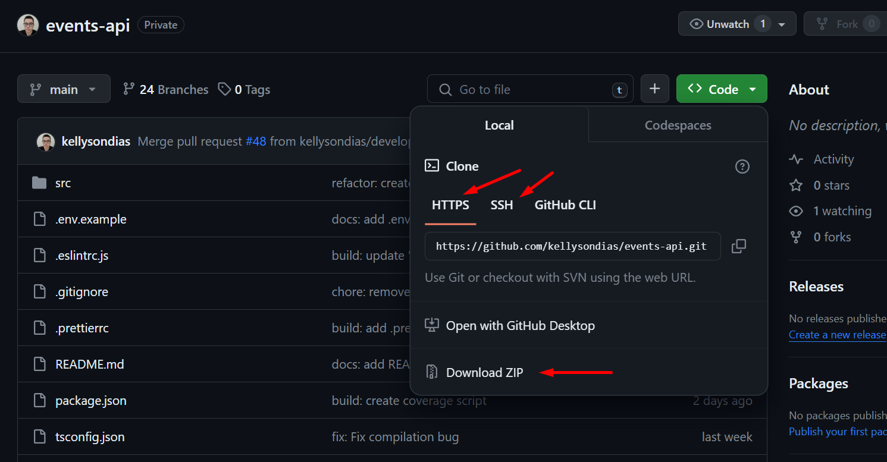
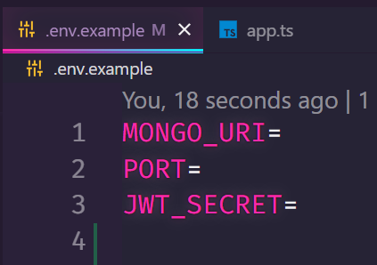

# Events API 🤵

## An API to register upcoming events. Powered by TypeScript and Express

-   [Getting Started](#getting-started)
    -   [Prerequisites](#prerequisites)
    -   [Installation](#installation)
    -   [Configuration](#configuration)
-   [Running the Server](#running-the-server)
-   [Endpoints](#endpoints)
    -   [Users](#users)
        -   [<URL>users/sign-up](#urluserssign-up)
        -   [<URL>users/sign-in](#urluserssign-in)
    -   [Events](#events)
        -   [<URL>events](#urlevents)
        -   [<URL>events/:id](#urleventsid)
-   [Acknowledgments](#acknowledgments)

## Getting Started

### Prerequisites

-   Node.js
-   A package manager of your preference

    -   <a href="https://classic.yarnpkg.com/lang/en/docs/install/#windows-stable">Yarn</a>
    -   npm
- <a href="https://www.mongodb.com/cloud/atlas/register">MongoDB Atlas</a> account

### Installation

1. Clone the GitHub repository in the desired folder. You can do it by copying the https link, the ssh link or downloading the zip file:
   

-   cloning with https link:

```powershell
git clone https://github.com/kellysondias/events-api
```

-   cloning with ssh link:

```powershell
git@github.com:kellysondias/events-api.git
```

3. After the project has been downloaded, you can navigate to the project's directory and install the dependencies with a package manager of your preference:

-   Navigate to the project's directory:

```powershell
cd path\of\your\cloned\folder
```

-   <a href="https://classic.yarnpkg.com/lang/en/docs/install/#windows-stable">Yarn</a> command:

    ```
    yarn install
    ```

-   npm command:
    ```
    npm install
    ```

### Configuration

1. Create a `.env` file in the root directory (in the same level as `package.json`). You can find a more practical example in the .env.example file.



2. Set the variables as below replacing the `<>` fields with your information:

-   `MONGO_URI`: "This is where your MongoDB Atlas URI will be set to create a database connection"

-   `PORT`: "This is where you'll choose in which port your local host server will run"

    -   **_Note_**: if `PORT` is not defined, it is set to `3000` automatically

-   `JWT_SECRET`: "This is where you'll store your JWT secret string for creating user's validation"

    -   You can run the `openssl rand -base64 32` command to generate a secret string

**Example:**

```
MONGO_URI='<your_db_URI>'
PORT=<choose_a_port>
JWT_SECRET=<your_secret>
```

## Running the Server

After all this configuration is set and ready to go:

1. Run the app with the dev script.

-   Yarn command:

    ```
    yarn dev
    ```

-   npm command:
    ```
    npm run dev
    ```

And now the API should be officially running :] .

## Endpoints

**_Note:_** `<URL>` equals `localhost:<your_port>/api/v1`

### Users:

#### `<URL>/users/sign-up`

-   HTTP Method
    -   _POST_ (Signs-up a new user)
        -   Required fields:
            ```
            {
                "firstName": "Lorem",
                "lastName": "Doe",
                "birthDate": "2023-12-28",
                "city": "string",
                "country": "string",
                "email": "jon@doe.com",
                "password": "Password1",
                "confirmPassword": "Password1"
            }
            ```

#### `<URL>/users/sign-in`

-   HTTP Methods
    -   _POST_ (Signs-in an user generating a web token)
        -   Required fields:
            ```
            {
                "email": "jon@doe.com",
                "password": "Password1",
            }
            ```

### Events:

**_Note:_** Every event route is only accessible through user's sign-in authentication

#### `<URL>/events`

-   HTTP Methods

    -   _POST_ (Creates a new event)

        -   Required fields:
            ```
            {
                "description": "string",
                "dayOfWeek": "monday"
            }
            ```

    -   _GET_ (Gets all events or specific events based on the day of the week they were created)

        -   Request parameter (optional):
            ```
            dayOfWeek=<day_of_week>
            ```

    -   _DELETE_ (Delete specific events based on the day of the week they were created)
        -   Request parameter (required):
            ```
            dayOfWeek=<day_of_week>
            ```

#### `<URL>/events:id`

-   HTTP Methods

    -   _GET_ (Gets all events based on the user's id)

    -   _DELETE_ (Deletes all events based on the user's id)

### Acknowledgments:

#### Developed by:

-   <a href="https://github.com/kellysondias">Kellyson Dias</a>

#### Special thanks:

-   <a href="https://github.com/SenhorAfonso/">Pedro Afonso</a>
-   <a href="https://github.com/GilbertosMedeiros">Gilberto Medeiros</a>
-   <a href="https://github.com/paulorayann">Paulo Rayann</a>
-   <a href="https://github.com/devrafamenegon">Rafael Henrique Menegon</a>
